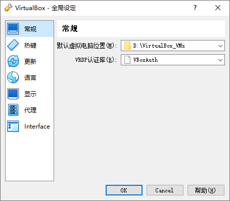
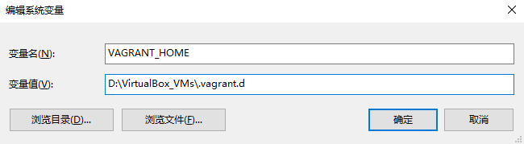

# vagrant_env_man
使用vagrant搭建各种集群

## vagrant 教程 

* [官网](https://www.vagrantup.com/)
* [Vagrant搭建虚拟化开发环境](https://zhuanlan.zhihu.com/p/27793159) 
* [超详细的 Vagrant 上手指南](https://zhuanlan.zhihu.com/p/259833884)


## 配置 VirtualBox

启动 VirtualBox 后，通过菜单 管理 -> 全局设定，或者按下快捷键 Ctrl + g，在全局设定对话框中，修改默认虚拟电脑位置，指定一个容量较大的磁盘。




## 配置 Vagrant

通过 Vagrant 创建虚机需要先导入镜像文件，也就是 box，它们默认存储的位置在用户目录下的 .vagrant.d 目录下，对于 Windows 系统来说，就是 C:\Users\用户名\.vagrant.d。

如果后续可能会用到较多镜像，或者你的 C 盘空间比较紧缺，可以通过设置环境变量 VAGRANT_HOME 来设置该目录。

在 Windows 系统中，可以这样操作：新建系统环境变量，环境变量名为 VAGRANT_HOME，变量值为 E:\VirtualBox_VMs\.vagrant.d



注意，最后这个 .vagrant.d 目录名称不是必须的，但是建议保持一致，这样一眼看上去就能知道这个目录是做什么用处的了。

## 关于基础镜像仓库

* [vagrant cloud](https://app.vagrantup.com/boxes/search)


## 国内使用
[Vagrant使用国内镜像安装插件和box镜像](https://cloud.tencent.com/developer/article/1658648)

## 常用命令

```
vagrant init  # 初始化
vagrant up  # 启动虚拟机
vagrant halt  # 关闭虚拟机
vagrant reload  # 重启虚拟机
vagrant suspend # 暂停虚拟机
vagrand resume # 恢复暂停的虚拟机
vagrant ssh  # SSH 至虚拟机
vagrand ssh-config # SSH cfg
vagrant status  # 查看虚拟机运行状态
vagrant destroy  # 销毁当前虚拟机
```


# 单台服务器


## 文件同步

* 安装插件
  ```
  vagrant plugin install vagrant-vbguest
  ```

* 配置
  ```
  Vagrant.configure("2") do |config|

    config.vm.box = "centos/7"
    # config.vm.box_url = "https://mirrors.ustc.edu.cn/centos-cloud/centos/7/vagrant/x86_64/images/CentOS-7.box"
    config.vm.box_version = "2004.01"
    config.vm.hostname = "centos7"
    # additions version when booting this machine
    config.vbguest.auto_update = false
    # do NOT download the iso file from a webserver
    config.vbguest.no_remote = true
    config.vbguest.installer_options = { allow_kernel_upgrade: true }
    # 使用公共的ssh 私钥
    config.ssh.insert_key = false
    # 将启用 vagrant-vbguest 插件的自动更新功能
    # config.vbguest.auto_update = true
    # 同步文件夹
    config.vm.synced_folder ".", "/v"
  end
 
  ```  


## 或者局部阿楼插件

  ```
  Vagrant.configure("2") do |config|

    config.vm.box = "centos/7"
    # config.vm.box_url = "https://mirrors.ustc.edu.cn/centos-cloud/centos/7/vagrant/x86_64/images/CentOS-7.box"
    config.vm.box_version = "2004.01"
    config.vm.hostname = "centos7"
    # 使用公共的ssh 私钥
    config.ssh.insert_key = false
    # 插件
    config.vagrant.plugins = ["vagrant-vbguest"] 

    # additions version when booting this machine
    config.vbguest.auto_update = false
    # do NOT download the iso file from a webserver
    config.vbguest.no_remote = true
    config.vbguest.installer_options = { allow_kernel_upgrade: true }

    # 将启用 vagrant-vbguest 插件的自动更新功能
    # config.vbguest.auto_update = true
    # 同步文件夹
    config.vm.synced_folder ".", "/v"
  end
  
  ```