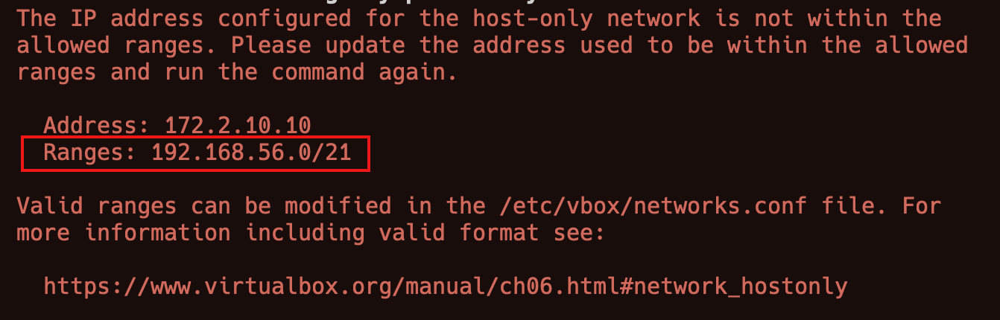
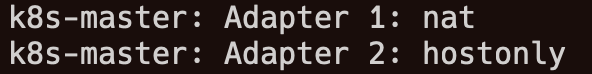
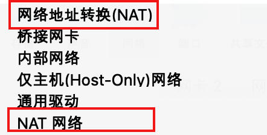

# kubernetes 集群搭建


## 准备工作：

- Vagrant 
  - 会自动安装VirtualBox 
- 基础镜像
  - ubuntu/jammy64 
  - 从mirrors.tuna.tsinghua.edu.cn 获取

```ruby
# vagrant init boxname url
vagrant init ubuntu/jammy64 
        \https://mirrors.tuna.tsinghua.edu.cn/ubuntu-cloud-images/jammy/current/jammy-server-cloudimg-amd64-vagrant.box
```

## 集群规划

用户名：`root`   密码：`kubeadmin`

| **主机名**  | **IP地址**     | **类型**               |
| ----------- | -------------- | ---------------------- |
| k8s-master  | 192.168.56.100 | Control Plane 控制平台 |
| k8s-worker1 | 192.168.56.101 | Node节点               |
| k8s-worker2 | 192.168.56.102 | Node节点               |

## 文件说明

```
bootstrap.sh     通用设置脚本(修改系统配置、使用阿里云镜像仓库、安装依赖)
kubeadm-init.sh  kubeadmin初始化控制平面脚本
Vagrantfile      Vagrant创建虚拟机配置文件
```


## 创建虚拟机并自动部署kubernetes集群

```bash
vagrant up
```


## 虚拟机IP

VirtualBox默认将`192.168.56.0/21`范围内的地址分配给虚拟机。可以使用以下命令查看IP地址范围。

```bash
VBoxManage list hostonlyifs
```

`Vagrantfile`中使用下面两个变量设置虚拟机的IP地址。

```ruby
#ip地址从192.168.56.20的开始递增
$ip_range   = "192.168.56."
$ip_start   = 100
```

如果`Vagrantfile`中的IP地址不在VirtualBox分配的范围内，会出现如下错误：

请根据提示修改`Vagrantfile`。

## 虚拟机网络



Vagrant创建的虚拟机总是将第一个网卡设置为网络地址转换`(NAT)`，不可更改。
NAT模式下，虚拟机只能单向访问外部网络(通常用来访问互联网)，虚拟机之间相互隔离，无法互相访问，每个虚拟机的IP都是`10.0.2.15`。
我们在`Vagrantfile` 中通过`private_network`添加了一个`Host-Only`网络，虚拟机之间使用这个网络进行通信，宿主机也可以通过IP地址访问虚拟机。

```ruby
master.vm.network "private_network", ip: $master_ip
```

`Host-Only`顾名思义，虚拟机仅对宿主机可见，宿主机之外的主机无法访问虚拟机，虚拟机也无法访问外部网络(互联网)。

> **注意：**
> 1. 网络地址转换**NAT**和**NAT**网络不一样。在VirtualBox官方文档中，网络地址转换的英文叫**NAT**，而NAT网络叫 **NAT network** 或 **NAT service**
> 
> 
> 
> 2. NAT网络可以为每个虚拟机设置不同的IP地址，虚拟机之间可以互相访问，也可以访问互联网，但是无法从外部网络访问虚拟机。
> 3. 参考文档：[https://www.virtualbox.org/manual/ch06.html](https://www.virtualbox.org/manual/ch06.html)

## calico网络

本次安装使用`calico`作为默认的网络插件(CNI)。
`calico`默认为`Pod`分配`192.168.0.0/16`范围内的IP地址，集群初始化时，`kubeadmin init`命令通过`--pod-network-cidr`参数也设置了IP地址的范围，二者如果一致，会导致本机无法访问Pod。
需要修改`calico.yaml`中的`CALICO_IPV4POOL_CIDR`的值与`--pod-network-cidr`一致。

```yaml
# The default IPv4 pool to create on startup if none exists. Pod IPs will be
# chosen from this range. Changing this value after installation will have
# no effect. This should fall within `--cluster-cidr`.
 - name: CALICO_IPV4POOL_CIDR
   value: "172.10.0.0/16"
```

由于虚拟机有多个网卡，Vagrant总是将第一个网卡设置为NAT（只能访问互联网，虚拟机之间无法互相访问）,为了使`calico`选择正确的网卡进行通信，将`IP_AUTODETECTION_METHOD`设置为第二个网卡`enp0s8`

```bash
kubectl set env daemonset/calico-node -n kube-system \
        IP_AUTODETECTION_METHOD=interface=enp0s8
```

## 其他说明

1. 本次安装只需一条命令，全程无需任何介入，无人值守全自动安装。
2. 安装脚本针对国内网络进行优化，安装过程中使用的所有包和镜像仓库全部替换成阿里云源，并为`containerd`配置了阿里云镜像加速。
3. 安装的版本为`kubernetes v1.26`，需要`containerd 1.6`或更高版本。

> ubuntu仓库里的containerd版本较低，因此使用docker仓库来安装containerd。

4. 从 **v1.25 **版本开始，谷歌镜像中心由`k8s.gcr.io`变更为`registry.k8s.io`。

> 例如containerd中使用的沙箱镜像变为了`registry.k8s.io/pause`,由于网络问题，脚本中将它替换成了`registry.aliyuncs.com/google_containers/pause`，不然可能导致kubernetes安装失败。

5. 本次安装使用自定义的`token`令牌，格式为`[a-z0-9]{6}.[a-z0-9]{16}`，可以在`Vagrantfile`中修改下面的变量设置令牌。

```bash
# k8s令牌
$k8s_token      = "123456.0123456789abcdef"
```

